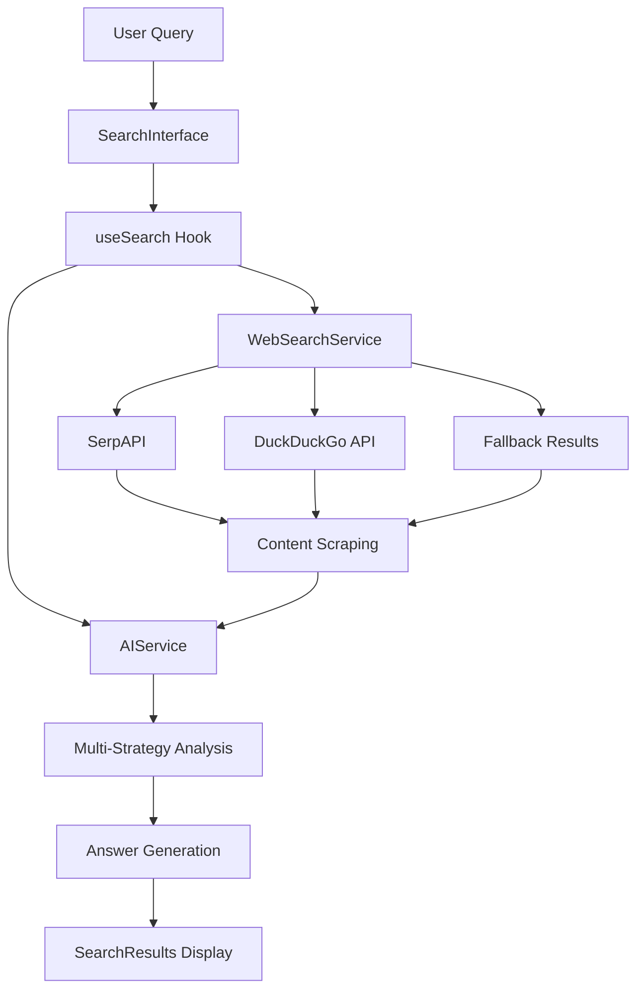

# 🌟 Fus-Search Bot - Intelligent Discovery Engine

> *Discover the depths of knowledge with Fus-Search Bot, an intelligent AI-powered search and discovery engine that combines real-time web search with advanced AI analysis.*


[](https://reactjs.org/)
[](https://www.typescriptlang.org/)
[](https://tailwindcss.com/)
[](https://vitejs.dev/)

## 📋 Table of Contents

- [✨ Features](#-features)
- [🚀 Quick Start](#-quick-start)
- [🛠️ Technology Stack](#️-technology-stack)
- [🏗️ Architecture](#️-architecture)
- [📁 Project Structure](#-project-structure)
- [🔧 Configuration](#-configuration)
- [🎨 Design System](#-design-system)
- [🔍 API Documentation](#-api-documentation)
- [🚀 Deployment](#-deployment)
- [💡 Usage Examples](#-usage-examples)
- [🧪 Testing](#-testing)
- [🤝 Contributing](#-contributing)
- [📝 License](#-license)

## ✨ Features

### 🔍 **Intelligent Search**
- **Multi-Source Web Search**: Integrates SerpAPI, DuckDuckGo, and fallback systems
- **Real-time Results**: Live web scraping and content analysis
- **Smart Fallbacks**: Graceful degradation when APIs are unavailable
- **Content Extraction**: Deep content scraping from multiple sources

### 🤖 **Advanced AI Processing**
- **Multi-Strategy Analysis**: Factual, analytical, and contextual answer generation
- **Query Classification**: Automatically detects query types (definition, how-to, comparison, etc.)
- **Confidence Scoring**: AI-calculated confidence levels for answers
- **Follow-up Generation**: Intelligent follow-up question suggestions

### 🎨 **Premium User Experience**
- **Apple-level Design**: Sophisticated, clean interface with attention to detail
- **Dark/Light Themes**: Seamless theme switching with system preference detection
- **Typing Animation**: Engaging typewriter effect for AI responses
- **Micro-interactions**: Thoughtful hover states and smooth transitions
- **Responsive Design**: Optimized for mobile, tablet, and desktop

### 📊 **Smart Features**
- **Search History**: Persistent search history with timestamp tracking
- **Source Citations**: Comprehensive source listing with relevance scores
- **Real-time Status**: Live indicators for search progress and AI analysis
- **Error Handling**: Graceful error recovery with user-friendly messages

## 🚀 Quick Start

### Prerequisites

```bash
Node.js >= 18.0.0
npm >= 8.0.0 or yarn >= 1.22.0
```

### Installation

1. **Clone the repository**
   ```bash
   git clone https://github.com/your-username/fus-search-bot.git
   cd fus-search-bot
   ```

2. **Install dependencies**
   ```bash
   npm install
   # or
   yarn install
   ```

3. **Environment setup** (Optional but recommended)
   ```bash
   cp .env.example .env
   ```
   
   Edit `.env` with your API keys:
   ```env
   # Optional: Enhanced search capabilities
   VITE_SERPAPI_KEY=your_serpapi_key_here
   VITE_SCRAPER_API_KEY=your_scraper_api_key_here
   ```

4. **Start development server**
   ```bash
   npm run dev
   # or
   yarn dev
   ```

5. **Open in browser**
   ```
   http://localhost:5173
   ```

### 🔑 API Keys Setup (Optional)

While Fus-Search Bot works without API keys using fallback systems, adding these keys significantly enhances functionality:

#### SerpAPI (Recommended)
- **Purpose**: Enhanced Google search results with better accuracy
- **Get API Key**: [serpapi.com](https://serpapi.com) (100 free searches/month)
- **Benefits**: Real-time Google results, better source quality

#### ScraperAPI (Recommended)
- **Purpose**: Reliable content extraction from web pages
- **Get API Key**: [scraperapi.com](https://scraperapi.com) (1000 free requests/month)
- **Benefits**: Bypass CORS restrictions, better content extraction

## 🛠️ Technology Stack

### **Frontend Framework**
- **React 18.3.1**: Modern React with hooks and concurrent features
- **TypeScript 5.5.3**: Full type safety and enhanced developer experience
- **Vite 5.4.2**: Lightning-fast build tool and dev server

### **Styling & UI**
- **Tailwind CSS 3.4.1**: Utility-first CSS framework
- **Lucide React**: Beautiful, customizable icons
- **Custom Design System**: Apple-inspired design principles

### **Search & AI**
- **SerpAPI**: Google search results integration
- **DuckDuckGo API**: Privacy-focused search fallback
- **Custom AI Service**: Multi-strategy answer generation
- **ScraperAPI**: Content extraction and web scraping

### **Development Tools**
- **ESLint**: Code linting with React and TypeScript rules
- **PostCSS**: CSS processing with Autoprefixer
- **Vite Proxy**: CORS handling for external APIs

## 🏗️ Architecture

### **System Overview**



### **Core Services**

#### **WebSearchService**
```typescript
class WebSearchService {
  // Multi-source search with intelligent fallbacks
  async searchWeb(query: string, numResults: number): Promise<Source[]>
  
  // Content extraction from web pages
  async scrapeContent(url: string): Promise<string>
  
  // Contextual fallback results generation
  private generateRelatedTopics(query: string): Array<{title: string, description: string}>
}
```

#### **AIService**
```typescript
class AIService {
  // Main answer generation with confidence scoring
  async generateAnswer(query: string, sources: Source[], content: string[]): Promise<{
    answer: string;
    followUpQuestions: string[];
    confidence: number;
  }>
  
  // Multiple analysis strategies
  private generateFactualAnswer(query: string, context: string): Promise<string>
  private generateAnalyticalAnswer(query: string, context: string): Promise<string>
  private generateContextualAnswer(query: string, context: string): Promise<string>
}
```

### **Search Flow**

1. **Query Input**: User enters search query in SearchInterface
2. **Search Execution**: useSearch hook triggers WebSearchService
3. **Multi-Source Search**: 
   - Primary: SerpAPI for Google results
   - Fallback: DuckDuckGo API
   - Final Fallback: Contextual topic generation
4. **Content Extraction**: Scrape detailed content from top sources
5. **AI Processing**: AIService analyzes content using multiple strategies
6. **Response Generation**: Comprehensive answer with citations
7. **Display**: SearchResults shows answer with typing animation

### **Fallback System**

The application implements a robust 3-tier fallback system:

```typescript
// Tier 1: SerpAPI (Premium Google results)
try {
  return await this.searchWithSerpAPI(query, numResults);
} catch {
  // Tier 2: DuckDuckGo (Free alternative)
  try {
    return await this.searchWithDuckDuckGo(query, numResults);
  } catch {
    // Tier 3: Contextual fallbacks (Always available)
    return await this.getFallbackResults(query);
  }
}
```

## 📁 Project Structure

```
fus-search-bot/
├── 📁 public/                 # Static assets
├── 📁 src/
│   ├── 📁 components/         # React components
│   │   ├── SearchInterface.tsx    # Main search input component
│   │   ├── SearchResults.tsx      # AI response display component
│   │   └── SearchHistory.tsx      # Search history management
│   ├── 📁 hooks/             # Custom React hooks
│   │   └── useSearch.ts          # Main search logic hook
│   ├── 📁 services/          # Business logic services
│   │   ├── webSearch.ts          # Web search and scraping service
│   │   └── aiService.ts          # AI processing and analysis service
│   ├── 📁 types/             # TypeScript definitions
│   │   └── index.ts              # Shared type definitions
│   ├── App.tsx               # Main application component
│   ├── main.tsx              # Application entry point
│   └── index.css             # Global styles and Tailwind imports
├── 📄 package.json           # Dependencies and scripts
├── 📄 vite.config.ts         # Vite configuration with proxy setup
├── 📄 tailwind.config.js     # Tailwind CSS configuration
├── 📄 tsconfig.json          # TypeScript configuration
└── 📄 README.md              # This file
```

### **Component Architecture**

#### **SearchInterface.tsx**
- Search input with real-time suggestions
- Error handling and loading states
- Query suggestions based on topic categories
- Form validation and submission

#### **SearchResults.tsx**
- Typing animation for AI responses
- Source citations with metadata
- Confidence scoring display
- Follow-up question generation

#### **SearchHistory.tsx**
- Persistent search history
- Click-to-search functionality
- History management (clear, limit)

## 🔧 Configuration

### **Environment Variables**

| Variable | Type | Description | Required | Default |
|----------|------|-------------|----------|---------|
| `VITE_SERPAPI_KEY` | string | SerpAPI key for Google search | No | - |
| `VITE_SCRAPER_API_KEY` | string | ScraperAPI key for content extraction | No | - |

### **Vite Configuration**

```typescript
// vite.config.ts
export default defineConfig({
  plugins: [react()],
  optimizeDeps: {
    exclude: ['lucide-react'],
  },
  server: {
    proxy: {
      '/api/serpapi': {
        target: 'https://serpapi.com',
        changeOrigin: true,
        rewrite: (path) => path.replace(/^\/api\/serpapi/, ''),
        secure: true,
      }
    }
  }
});
```

### **Tailwind Configuration**

```javascript
// tailwind.config.js
export default {
  content: ['./index.html', './src/**/*.{js,ts,jsx,tsx}'],
  theme: {
    extend: {
      // Custom design system extensions
    },
  },
  plugins: [],
};
```

## 🎨 Design System

### **Color Palette**

```css
/* Primary Colors */
--purple-500: #8b5cf6
--purple-600: #7c3aed
--pink-500: #ec4899
--pink-600: #db2777

/* Neutral Colors */
--gray-50: #f9fafb
--gray-900: #111827
--slate-800: #1e293b
--slate-900: #0f172a
```

### **Typography Scale**

- **Headings**: Inter font family, 120% line height
- **Body**: Inter font family, 150% line height
- **Code**: JetBrains Mono, monospace

### **Spacing System**

Based on 8px grid system:
- `space-1`: 4px
- `space-2`: 8px
- `space-4`: 16px
- `space-6`: 24px
- `space-8`: 32px

### **Component Patterns**

#### **Glass Morphism Cards**
```css
backdrop-blur-xl bg-white/70 border border-white/20 shadow-xl
```

#### **Gradient Buttons**
```css
bg-gradient-to-r from-purple-500 to-pink-500 hover:from-purple-600 hover:to-pink-600
```

## 🔍 API Documentation

### **Search API Flow**

#### **1. Web Search**
```typescript
interface SearchParams {
  query: string;
  numResults?: number; // Default: 10
}

interface Source {
  id: string;
  title: string;
  url: string;
  snippet: string;
  domain: string;
  publishedDate?: string;
  relevanceScore?: number;
}
```

#### **2. Content Scraping**
```typescript
interface ScrapingResult {
  url: string;
  content: string; // Extracted text content
  success: boolean;
}
```

#### **3. AI Analysis**
```typescript
interface AIResponse {
  answer: string;
  followUpQuestions: string[];
  confidence: number; // 0.0 - 1.0
}
```

### **Error Handling**

The application implements comprehensive error handling:

```typescript
// Graceful degradation
try {
  // Primary API call
} catch (primaryError) {
  try {
    // Fallback API call
  } catch (fallbackError) {
    // Use offline/cached results
  }
}
```

## 🚀 Deployment

### **Build for Production**

```bash
# Create optimized production build
npm run build

# Preview production build locally
npm run preview
```

### **Deploy to Netlify**

1. **Build settings**:
   - Build command: `npm run build`
   - Publish directory: `dist`

2. **Environment variables**:
   ```
   VITE_SERPAPI_KEY=your_key_here
   VITE_SCRAPER_API_KEY=your_key_here
   ```

### **Deploy to Vercel**

```bash
# Install Vercel CLI
npm i -g vercel

# Deploy
vercel --prod
```

### **Performance Optimizations**

- **Code Splitting**: Automatic route-based splitting
- **Tree Shaking**: Unused code elimination
- **Asset Optimization**: Image and CSS optimization
- **Caching**: Aggressive caching for static assets

## 💡 Usage Examples

### **Basic Queries**

```typescript
// Simple factual questions
"What is quantum computing?"
"How does photosynthesis work?"
"Define machine learning"

// Current events
"Latest developments in renewable energy"
"Recent AI breakthroughs 2024"
"Current space exploration missions"

// Comparative analysis
"React vs Vue.js comparison"
"Electric cars vs hybrid vehicles"
"iOS vs Android development"

// How-to queries
"How to start a podcast"
"How to learn Python programming"
"How to invest in stocks"
```

### **Advanced Features**

#### **Follow-up Questions**
After each search, Fus-Search Bot generates intelligent follow-up questions:
- Related topics exploration
- Deeper technical details
- Practical applications
- Future implications

#### **Search History**
- Persistent across sessions
- Click to re-search
- Timestamp tracking
- Easy history management

#### **Confidence Scoring**
- **High (80%+)**: Multiple reliable sources, comprehensive content
- **Medium (60-80%)**: Good sources, moderate content depth
- **Lower (<60%)**: Limited sources or content

## 🧪 Testing

### **Manual Testing Checklist**

- [ ] Search functionality with various query types
- [ ] Dark/light mode switching
- [ ] Responsive design on different screen sizes
- [ ] Error handling with invalid queries
- [ ] API fallback systems
- [ ] Search history functionality
- [ ] Follow-up question generation

### **Performance Testing**

```bash
# Lighthouse audit
npm run build
npm run preview
# Run Lighthouse on localhost:4173
```

### **API Testing**

Test the fallback system by:
1. Testing without API keys (fallback mode)
2. Testing with invalid API keys (error handling)
3. Testing with valid API keys (full functionality)

## 🤝 Contributing

### **Development Setup**

1. **Fork the repository**
2. **Create feature branch**
   ```bash
   git checkout -b feature/amazing-feature
   ```
3. **Make changes and test**
4. **Commit with conventional commits**
   ```bash
   git commit -m "feat: add amazing feature"
   ```
5. **Push and create PR**

### **Code Standards**

- **TypeScript**: Strict mode enabled
- **ESLint**: React and TypeScript rules
- **Prettier**: Code formatting
- **Conventional Commits**: Commit message format

### **Pull Request Process**

1. Update documentation if needed
2. Add tests for new features
3. Ensure all checks pass
4. Request review from maintainers

## 📈 Roadmap

### **Upcoming Features**

- [ ] **Voice Search**: Speech-to-text integration
- [ ] **Export Results**: PDF/Markdown export functionality
- [ ] **Advanced Filters**: Date, source type, language filters
- [ ] **Collaborative Features**: Share searches and results
- [ ] **API Integration**: More search providers
- [ ] **Offline Mode**: Cached results for offline access

### **Performance Improvements**

- [ ] **Caching Layer**: Redis-based result caching
- [ ] **CDN Integration**: Global content delivery
- [ ] **Progressive Loading**: Incremental result loading
- [ ] **Background Sync**: Pre-fetch popular queries

## 📝 License

This project is licensed under the MIT License - see the [LICENSE](LICENSE) file for details.

```
MIT License

Copyright (c) 2024 Fus-Search Bot

Permission is hereby granted, free of charge, to any person obtaining a copy
of this software and associated documentation files (the "Software"), to deal
in the Software without restriction, including without limitation the rights
to use, copy, modify, merge, publish, distribute, sublicense, and/or sell
copies of the Software, and to permit persons to whom the Software is
furnished to do so, subject to the following conditions:

The above copyright notice and this permission notice shall be included in all
copies or substantial portions of the Software.
```

## 🙏 Acknowledgments

- **Inspiration**: Perplexity AI, Morphic, and modern search engines
- **Design**: Apple's Human Interface Guidelines
- **Icons**: Lucide React icon library
- **APIs**: SerpAPI and ScraperAPI for enhanced functionality
- **Community**: React and TypeScript communities

## 📞 Support & Contact

### **Getting Help**

1. **Documentation**: Check this README and inline code comments
2. **Issues**: [GitHub Issues](../../issues) for bug reports and feature requests
3. **Discussions**: [GitHub Discussions](../../discussions) for questions and ideas

### **Bug Reports**

When reporting bugs, please include:
- Browser and version
- Steps to reproduce
- Expected vs actual behavior
- Console errors (if any)
- Screenshots (if applicable)

### **Feature Requests**

For feature requests, please describe:
- Use case and motivation
- Proposed solution
- Alternative solutions considered
- Additional context

---

<div align="center">

**🌟 Fus-Search Bot - Discover the depths of knowledge with intelligent AI-powered search and discovery 🌟**

[⭐ Star this repo](../../stargazers) | [🐛 Report Bug](../../issues) | [💡 Request Feature](../../issues) | [🤝 Contribute](../../pulls)

</div>